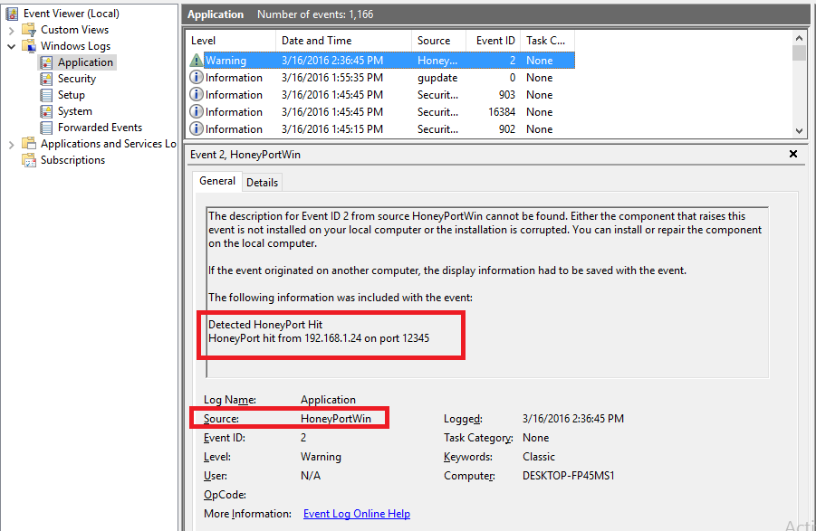
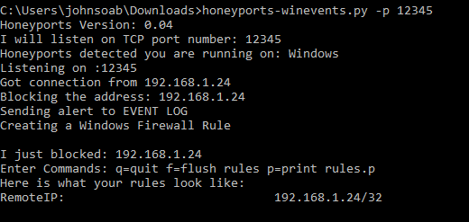

# Readme

This version is compatible with Python3, but also requires pywin32 to be installed for the purposes of Event Logging.
PyWin32 available via: https://sourceforge.net/projects/pywin32/
## Event Log

## Console

